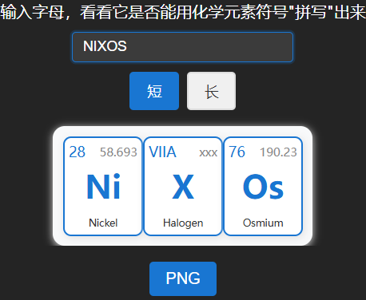
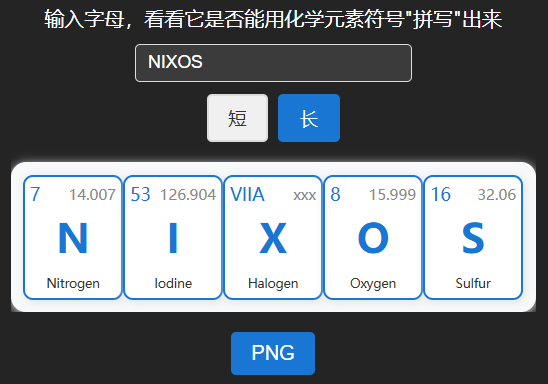
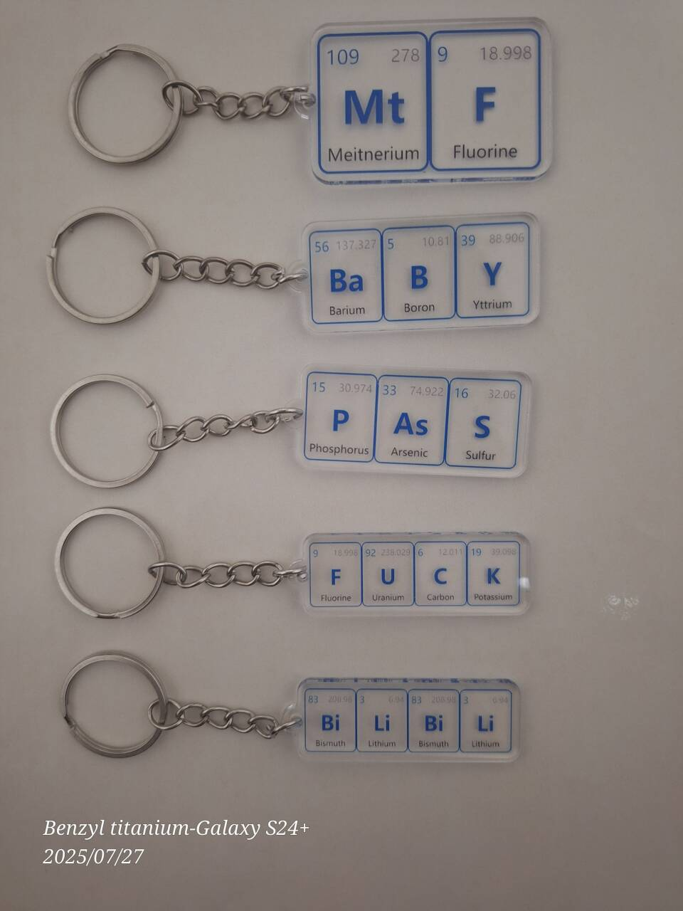

# ChemElemSplice

- [化学元素拼接器](https://chemelemsplice.pages.dev)
- 输入字母，看看它是否能用化学元素符号"拼写"出来

## Demo

|  |  |
|---|---|

## Examples

|  |  |
|---|---|
|  |  |
|  |  |
|  |  |

- [more](docs/examples/imgs)

## 实物（支持定制）

