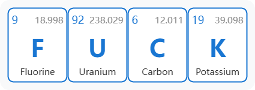
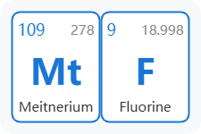
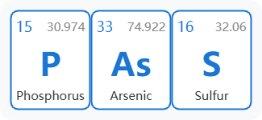
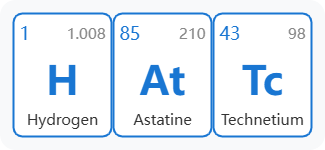
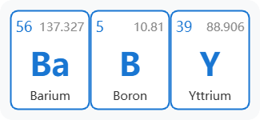
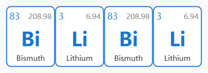
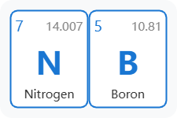
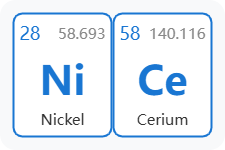
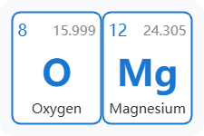

# ChemElemSplice

化学元素拼接器

## Usage

```
npm install
npm run dev
```

```ts
// src/elements.ts
export const customOrder: number[] = [9,92,6,19]; // FUCK
```

```js
const exportPNG = async () => {
  if (tableRef.value) {
    const canvas = await html2canvas(tableRef.value, {
      scale: 2, // 控制清晰度
    });
    const link = document.createElement('a');
    link.href = canvas.toDataURL('image/png');
    link.download = getSymbolName() + '.png';
    link.click();
  }
};
```

## Examples

|  |  |
|---|---|
|  |  |
|  |  |
|  |  |
