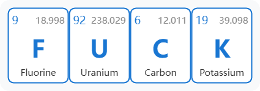
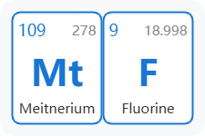
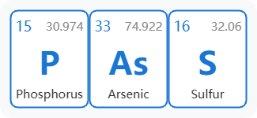
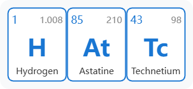
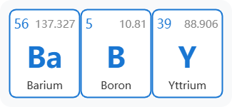
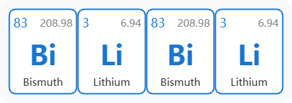
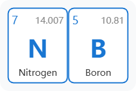
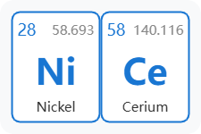
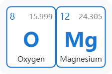

# ChemElemSplice

- 化学元素拼接器
- [元素检查器: 是否能用化学元素符号“拼写”出来](https://benzyl-titanium.github.io/ChemElemSplice/examples/search.html)

## Usage

```
npm install
npm run dev
```

```ts
// src/elements.ts
export const customOrder: (number | string)[] = [59, 8, "D", 92, 6, "T"]; // product 氘 "D" 和氚 "T"
```

```js
// src/components/ElementTable.vue
const exportPNG = async () => {
  if (tableRef.value) {
    const canvas = await html2canvas(tableRef.value, {
      scale: 10, // 控制清晰度
    });
    const link = document.createElement('a');
    link.href = canvas.toDataURL('image/png');
    link.download = getSymbolName() + '.png';
    link.click();
  }
};
```

## Examples

|  |  |
|---|---|
|  |  |
|  |  |
|  |  |

- [more](docs/examples/imgs)
